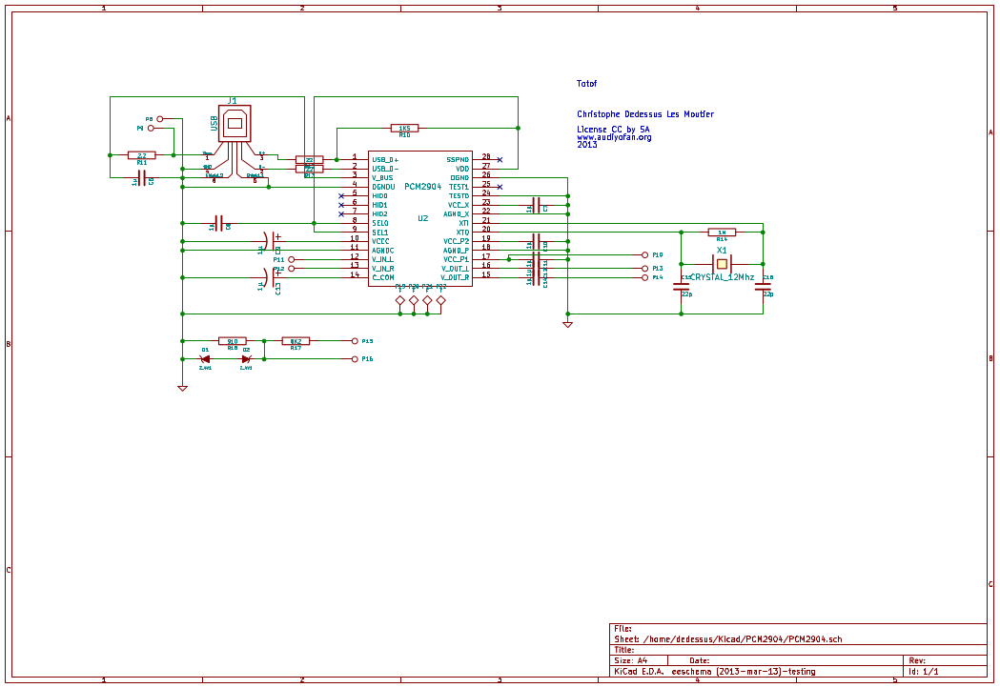
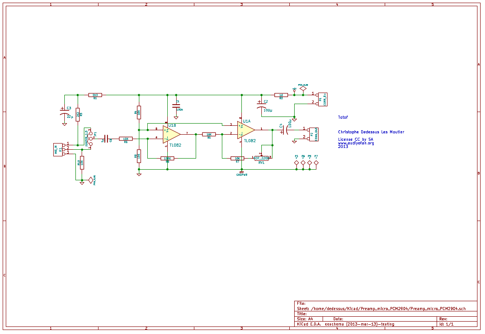

Preamp_micro_USB
================

A small project to measure speaker with an electret via USB

If you would have more information about this project please visit 
www.audiyofan.org

A link to the dedicated post 
http://www.audiyofan.org/forum/viewtopic.php?f=57&t=8948

It's just a box connected via USB , you don't need an external sound card to measure your speakers,

You can use REW or ARTA ( free demo version ) or an other program,

The project is based on a capsule electret, a microphone preamp, a loopback
and a second channel with a secured probe to measure the voltage across the speaker ( for ARTA )
connected via a PCM2904 from BB/TI

Under Linux & Mac no drivers is required
Under Windows you can find in the folder "Drivers_windows" all you need to run this box properly

PCB & schema are designed with Kicad

All comments are welcome

Totof

